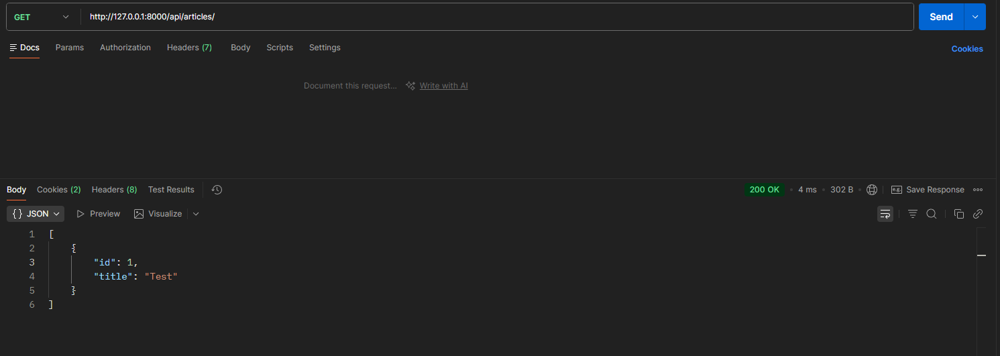
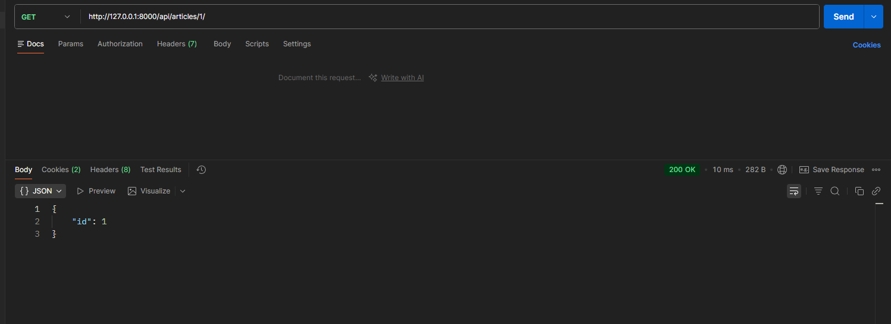

# Django Articles API

Цей проєкт є навчальним прикладом створення простого API для управління статтями. 
Він включає моделі для авторів (використовується стандартний `User`) та статей.

## Використані технології

Проєкт базується на наступних основних бібліотеках та сервісах:

- **Django 6.0.4** — основний фреймворк.
- **psycopg2-binary 2.9.11** — адаптер для роботи з PostgreSQL.
- **python-dotenv 1.2.2** — для керування змінними середовища.
- **Supabase (PostgreSQL)** — хмарна база даних (використовується **Transaction Pooler**).

## Як запустити проєкт

### 1. Клонування репозиторію та підготовка

Переконайтеся, що у вас встановлено Python (рекомендовано 3.10+).

### 2. Створення віртуального середовища

```bash
python -m venv venv
# Активуйте віртуальне середовище:
# Windows:
venv\Scripts\activate
# Linux/macOS:
source venv/bin/activate
```

### 3. Встановлення залежностей

```bash
pip install -r requirements.txt
```

> **Примітка для користувачів macOS:** На комп'ютерах з чипами Apple Silicon (M1/M2/M3) для коректного встановлення `psycopg2-binary` може знадобитися встановлений PostgreSQL у системі. Ви можете встановити його за допомогою Homebrew: `brew install postgresql`.

### 4. Налаштування середовища

Проєкт використовує змінні середовища через файл `.env`.

1. Скопіюйте приклад файлу налаштувань:
   ```bash
   # macOS / Linux / Windows PowerShell:
   cp .env.example .env

   # Windows Command Prompt (CMD):
   copy .env.example .env
   ```
2. Відкрийте файл `.env` та заповніть його власними даними (наприклад,
   параметри підключення до бази даних).

Обов'язкові змінні:

- `SECRET_KEY`: Секретний ключ Django.
- `DEBUG`: Режим розробки (`true` або `false`).
- `DB_NAME`, `DB_USER`, `DB_PASSWORD`, `DB_HOST`, `DB_PORT`: Налаштування бази
  даних PostgreSQL.
  > **Важливо:** Для роботи з **Supabase** рекомендується використовувати **Transaction Pooler** (порт `6543`).
- `ALLOWED_HOSTS`: JSON-список дозволених хостів (наприклад, `["127.0.0.1", "localhost"]`).

Приклад налаштувань (для **Supabase Transaction Pooler**):

```env
SECRET_KEY=your_key
DEBUG=true
ALLOWED_HOSTS=[]

DB_NAME=postgres
DB_USER=postgres.xxxxxxxxxxxxxxxxxxxx
DB_PASSWORD=your_password
DB_HOST=aws-0-eu-central-1.pooler.supabase.com
DB_PORT=6543
```

### 5. Застосування міграцій

```bash
# Перейдіть у папку blog
cd blog
python manage.py migrate
```

### 6. Запуск сервера розробки

```bash
python manage.py runserver
```

Тепер проєкт доступний за адресою `http://127.0.0.1:8000/`.

---

## Опис моделей

Проєкт складається з наступних моделей у додатку `articles`:

### 1. Article (Стаття)

Основна модель статті.

- `title` (CharField): Назва статті.
- `content` (TextField): Вміст статті.
- `author` (ForeignKey): Зв'язок з моделлю `User` (Many-to-One).
- `created_at` (DateTimeField): Дата створення (автоматично).
- `is_published` (BooleanField): Прапор публікації.

---

## Скріншоти запитів з Postman

### Отримання списку статей (`GET /api/articles/`)



### Отримання конкретної статті за ID (`GET /api/articles/1/`)


